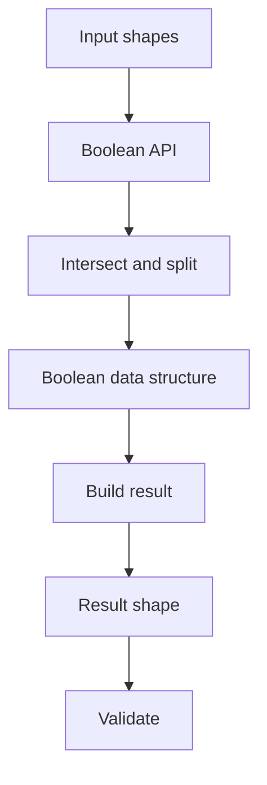

# Walkthrough: Booleans (Fuse/Common/Cut)

This walkthrough is meant to make OCCT booleans feel like a debuggable pipeline rather than a black box.

Repro + oracle: `notes/walkthroughs/booleans-cases.md`.

## What you should learn

- What the boolean “pipeline” phases are (intersect/split → build).
- What to look at first when a boolean fails (errors/warnings vs invalid results).
- How to interpret the lane repro oracle (`booleans.json`) as a health check.

## Read the oracle output (step-by-step)

Open `repros/lane-booleans/golden/booleans.json`:

1) Inputs are sanity-checked via bbox
   - `inputs.boxA.bbox` and `inputs.boxB.bbox` confirm the operands you think you built are the operands that were actually used.

2) Each operation is checked for “health”
   - `ops.<op>.has_errors` / `ops.<op>.has_warnings`
     - If `has_errors=true`, treat it as “pipeline failed” (intersection/splitting/build aborted or produced an unusable result).
     - If `has_warnings=true`, you may still get a result, but it is often numerically fragile.

3) Each result is checked for validity (topology/geometry consistency)
   - `ops.<op>.is_valid` is `BRepCheck_Analyzer::IsValid()`.
   - A result can be non-null but invalid; this is a classic “looks plausible but breaks later” scenario.

4) Topology size proxies help you detect structural change
   - `ops.<op>.counts.{solids,faces,edges,vertices}`
   - These are not “correctness” by themselves, but they are extremely useful for regression and for answering “did the algorithm split or merge more than before?”

5) Result bbox is a geometric sanity check
   - `ops.<op>.bbox` should match the expected extents for fuse/common/cut.

## The pipeline model (mental picture)

If you want the concrete code anchors behind these boxes, follow the booleans hub:
- `notes/maps/hub-booleans.md`

## Failure triage playbook

When a boolean fails in “real work”, the fastest triage order is:

1) Check `has_errors/has_warnings` (algorithm diagnostics)
2) Check `is_valid` (structural sanity)
3) Compare `counts` (did splitting explode?)
4) Compare `bbox` (did we get something in the right place?)
5) If needed: heal inputs first (`notes/maps/hub-shape-healing-analysis.md`)
