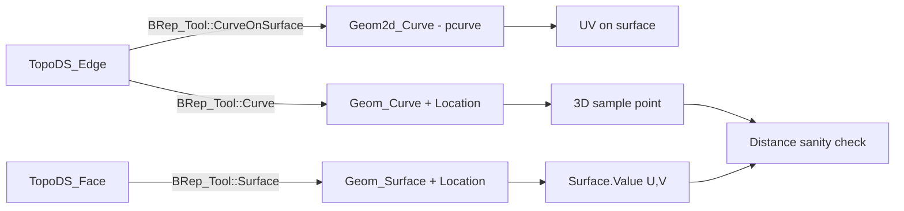

# Walkthrough: B-Rep geometry bridge (3D curves, pcurves, locations)

This walkthrough makes the “multiple representations” model concrete: a topological edge can have a 3D curve, a 2D pcurve on a face, and a triangulation/polygon representation, and OCCT picks among them depending on context.

## What you should learn

- Why an edge has both a 3D curve and a pcurve (and why they are not redundant).
- Why “location” is part of almost every answer (`TopLoc_Location` composition).
- How to sanity-check that a pcurve + surface really matches the 3D edge.

Repro + oracle: `notes/walkthroughs/brep-geometry-bridge-cases.md`.

## Read the oracle output (step-by-step)

Open `repros/lane-brep-geometry-bridge/golden/bridge.json`:

1) Edge tolerance + parameterization flags
   - `edge.tolerance` is the edge’s tolerance (clamped to at least `Precision::Confusion()` by `BRep_Tool`).
   - `edge.same_parameter` and `edge.same_range` tell you whether OCCT considers the pcurve/3D curve parameterizations consistent.

2) The edge’s 3D curve representation
   - `edge.curve3d.type` (e.g. `Geom_Line`)
   - `edge.curve3d.first/last` parameter range
   - `edge.curve3d.mid_point_world` is a sampled point in world space
   - `edge.curve3d.location` is the returned location for the curve representation

3) The edge’s pcurve on a specific face
   - `edge.pcurve.type` (e.g. `Geom2d_Line`)
   - `edge.pcurve.first/last` parameter range in 2D curve parameter space
   - `edge.pcurve.mid_uv` is a sampled UV point on the face’s surface

4) The face’s surface representation
   - `face.surface_type` (e.g. `Geom_Plane`)
   - `face.surface_mid_from_pcurve` is `Surface.Value(U,V)` evaluated at the pcurve’s midpoint UV
   - `face.curve_surface_mid_distance` should be ~0: it’s the distance between the 3D edge point and the surface point implied by the pcurve

5) Location effects (the “gotcha”)
   - `location_effect.move` is the transform applied to a moved copy of the face/edge
   - `location_effect.surface_location` shows that the returned surface comes with a location too
   - If you ignore these locations, geometry will be “right but in the wrong place”.

6) Triangulation as a derived representation
   - `triangulation.has_face_triangulation` indicates whether meshing produced a face triangulation
   - `triangulation.nb_nodes` / `triangulation.nb_triangles` are size proxies
   - `triangulation.has_edge_polygon_on_triangulation` tells you whether there is a discrete edge representation on the triangulation

## The bridge model (mental picture)

For the code spine behind these boxes:
- `notes/maps/hub-brep-geometry-bridge.md`

## Failure triage playbook

- `curve_surface_mid_distance` not ~0: suspect `SameParameter/SameRange` problems or a missing/synthesized pcurve.
- Pcurve appears “missing”: planar faces can trigger a synthesized pcurve fallback; treat that as a signal the representation wasn’t explicitly stored.
- Geometry is shifted: you’re probably dropping locations.
